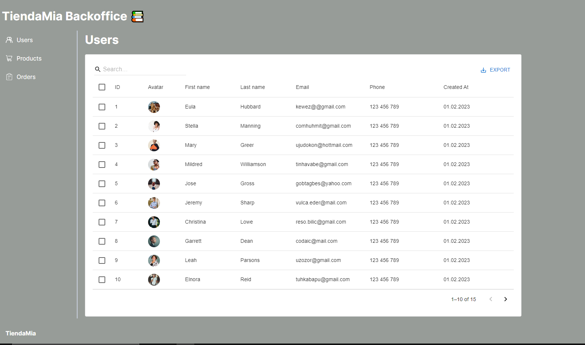

# App BAckoffice TiendaMia 📚

## Starting 🚀


### Prerequisites 📋

```
Nodejs 14.x.x or higher
```

### Installation 🔧


A little intro about the installation. 
```
$ git clone https://github.com/juliocesar898/tienda-mia-backoffice-frontend.git
$ cd /tienda-mia-backoffice-frontend
$ npm install
$ npm run dev
```
You should be able to see the following menu



## Deployment 📦

Coming soon...

## Built with 🛠️

* [ReactJs](https://react.dev) 


## Author ✒️

* **Julio Flores** - *Initial Work* - [juliocesar898](https://github.com/juliocesar898)


---
⌨️ By [juliocesar898](https://github.com/juliocesar898) 📘
